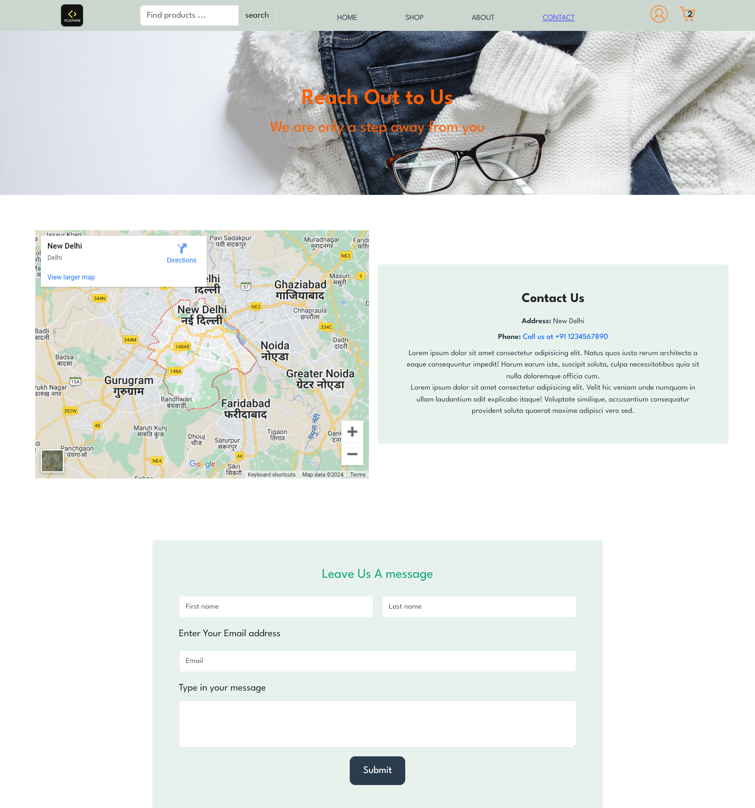

# Rudra18 - The Ultimate eCommerce Experience

Welcome to **Rudra18**, a modern eCommerce platform built with ReactJS, Bootstrap, HTML, CSS, and JavaScript. Rudra18 delivers a seamless shopping experience with a fully responsive design and robust features.

## 🚀 Features

- **Comprehensive eCommerce Functionality**: Explore products, manage your cart, and complete purchases effortlessly.
- **Dynamic Routing**: Smooth navigation with React Router.
- **Consistent Layout**: A unified design with a header, footer, and navigation menu.
- **Global State Management**: Efficient data sharing with React Context.
- **Responsive Design**: Optimized for both mobile and desktop devices.

## 📷 Screenshots

### Home Page


### Shop Page


### Contact Page


### Cart Page


### Checkout Page


## 🎨 Technologies Used

- **ReactJS**: For creating dynamic and interactive user interfaces.
- **Bootstrap**: For responsive design and pre-built components.
- **HTML & CSS**: For structuring and styling web pages.
- **JavaScript**: For handling dynamic interactions and functionalities.

## 🔧 Installation Instructions

To set up Rudra18 locally, follow these steps:

1. **Clone the Repository**:
   ```bash
   git clone https://github.com/yourusername/rudra18.git

2. **Navigate to the Project Directory**:
   ```bash
   cd rudra18
   ```
3. **Install Dependencies**:
   ```bash
   npm install
   ```
4. **Start the Development Server**:
   ```bash
   npm start
   ```

## 💡 Usage

- **Home Page**: Discover featured products, new arrivals, and special deals.
- **Shop Page**: Browse and filter products to find what you need.
- **Cart Page**: Manage items in your cart and proceed to checkout.
- **Account Management**: Login, sign up, and recover your password with ease.

## 🛠️ Contributing

We welcome contributions to enhance Rudra18. If you wish to contribute, please refer to our [Contributing Guide](#) for details on how to get involved.

## 📜 License

This project is licensed under the MIT License. See the [LICENSE](#) file for more details.

## 🤝 Support

If you encounter any issues or have questions, feel free to reach out or open an issue on GitHub.

---

Thank you for checking out Rudra18! Enjoy exploring and contributing to the project.
```

This `README.md` file provides a clear and structured overview of the Rudra18 project, including details on usage, contribution guidelines, licensing, and support. Adjust the placeholder links and text as needed for your specific project details.
